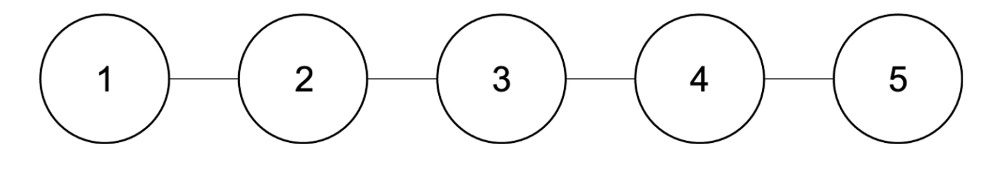
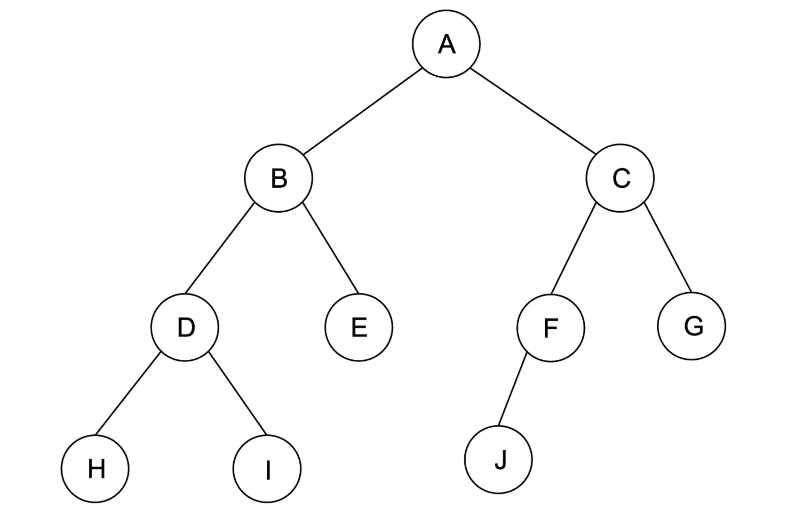

# 1주차 (기초 지식)

## 알고리즘과 자료구조

### 자료구조란?

**자료구조는(Data Structure)는 개발자가 데이터를 효율적으로 사용할 수 있도록 정리하는 방법을 의미**

#### 자료구조의 종류

1. 선형 자료구조

   - Array
   - Dynamic Array
   - Linked List
   - Queue
   - Stack
   - Hash Table

2. 비선형 자료구조
   - Tree
   - Graph

**선형 자료구조란 원소들을 하나씩 순차적으로 나열시킨 형태입니다.**

**자료들 간의 앞뒤 관계가 1:1의 선형관계**



비선형 자료구조란 **하나의 자료 뒤에 여러개의 자료가 존재할 수 있는 형태**

- 자료들간의 앞, 뒤 관계가 **1:n 또는 n:n의 관계**
- 대표적인 비선형 자료구조: 트리, 그래프
- 계층적 구조를 나타내기에 적합



### 알고리즘이란?

**문제를 해결하기 위한 단계적 절차**

알고리즘을 설계한다는 것: 문제 풀이 절차를 설계한다는 것
알고리즘을 구현한다는 것: 프로그래밍 언어를 이용해 문제 풀이 절차를 실제로 동작하는 코드로 작성한다는 것

📌 문제를 해결하기 위한 정해진 일련의 절차나 방법

문제가 축적됨에 따라 자주 쓰이는 문제 해결 방법 발생
이 방법(알고리즘)을 패턴화시켜서 이름 붙이게 된 것이 bfs, 다익스트라, 투포인터 등

적절한 자료구조를 이용해 구현한 알고리즘으로 특정 문제를 매우 효율적으로 해결할 수 있음

📌 알고리즘 문제풀이란 해당 문제를 풀기 위해 적절한 자료구조를 선택하고 그 자료구조를 이용해 적합한 알고리즘을 구현하는 것

ex)
bfs - queue
다익스트라 - heap

한 문제를 해결하는 알고리즘은 다양하기 때문에 문제에 가장 적합한 알고리즘을 선택할 수 있어야 함
이를 위해 알고리즘의 장단점과 특징을 알고 있어야 함

### 알고리즘 평가 기준

1. 시간 복잡도
2. 공간 복잡도
3. 구현 복잡도

한국 기업 코테는 시간 복잡도만 신경쓰면 됨

시간 복잡도와 공간 복잡도는 trade-off 관계에 있음
실행시간을 줄이기 위해선 memory 사용이 늘어나고, 메모리 사용량을 줄이기 위해선 시간을 더 사용해야 하기 때문

제약조건 예시

```
1번 문제 : 1 <= n <= 10^5 # 10에 5승
2번 문제 : 1 <= n <= 10^3
3번 문제 : 1 <= n <= 8
```

1번 문제는 O(n^2) 의 시간복잡도를 가지고 풀명 10^10 이 나옴.
따라서 제약조건인 10^8을 넘기 때문에 O(nLogN) 이하의 시간복잡도 알고리즘을 사용해야 함

2번 문제의 경우 10^3 을 제곱해도 10^6 이므로 O(n^2) 을 사용해도 된다는 뜻.

이런 식으로 제약조건을 보고 어떤 시간복잡도를 가진 알고리즘을 써야할지 유추 가능.
각 알고리즘이 어떤 시간복잡도를 가질지는 직접 문제를 풀면서 정리하고 외워야 함.

📌 정리

1. 데이터 개수 \* 시간 복잡도의 값이 10^8 을 넘으면 안된다.
2. 10^8 이내로 계산 가능한 알고리즘 중에서 가장 효율적인 것을 찾는 연습을 해야한다.
