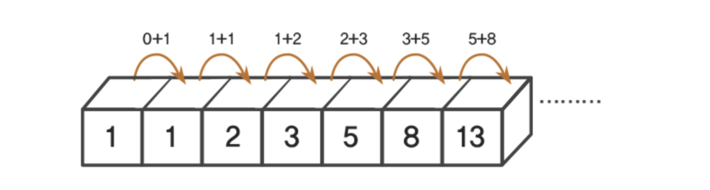

# 1주차 - 완전탐색 & 재귀

> 완전탐색과 재귀가 묶인 이유: 완전탐색은 재귀로 푸는 경우가 많아서 재귀 마스터시 완전탐색 수월하게 공부 가능

## 01 재귀

> 재귀는 **하나의 함수에서 자기 자신을 호출해 작업을 수행**하는 알고리즘

재귀의 특징

1. 재귀가 종료되는 조건과 자기 자신을 호출하는 파트로 나뉨
2. 특정 입력에 대해서 자기 자신을 호출하지 않고 종료되어야 함
3. 모든 입력은 base condition 으로 수렴

재귀의 특징2

1. 모든 재귀 함수는 재귀 구조 없이 반복문만으로 동일한 동작을 하는 함수를 만들 수 있음
2. 재귀는 적재적소에 사용하면 코드가 간결해지지만 함수 호출이 꽤 비용이 꽤 큰 연산이기 때문에 메모리와 시간에서 손해를 봄
3. 굳이 재귀를 쓰지 않아도 구현에 큰 어려움이 없으면 재귀 대신 반복문으로 코드를 짜는 것도 좋음

📌 다양한 문제들을 풀면서 경험적으로 어떨 때 재귀를 사용하면 유리하고 어떨 때 굳이 사용할 필요 없는지 알게 될 것

### 01.5 피보나치 수열을 구하는 코드를 재귀로 구현하시오.



1. 재귀가 종료되는 조건
   return 값이 0 이거나 1일 때 -> 더 쪼갤 단위가 없기 때문

2. 자신을 호출하는 경우
   return Fibonacci(n - 1) + Fibonacci(n - 2) -> Fibonacci 수열의 정의

3. 과도한 재귀 방지를 위한 mapping table 추가
   map = {2:2, 3:3, 4:5, 5:8, ...}

4. 구현

```ts
const map: Record<number, number> = {}

const Fibonacci = (n: number) => {
  if (n === 0 || n === 1) return 1
  if (map[n]) return map[n]

  const FibonacciValue = Fibonacci(n - 1) + Fibonacci(n - 2)
  map[n] = FibonacciValue

  return FibonacciValue
}
```

## 02 완전 탐색

> 완전탐색은 brute force 알고리즘 이라고도 불리며 순전히 힘으로 밀어붙인다는 느낌으로 무식하게 모든 경우를 다 계산하는 방법

### 완전탐색 구현 방법

1. for/while
2. 재귀함수

**보통 간단한 문제는 for/while로, 어려운 문제는 재귀함수를 사용한다고 생각하면 직관적**
완전탐색만으로 푸는 문제는 거의 안나온다고 보면 되지만 **완전탐색으로 구현해야하는 부분을 빠르게 풀 수 있다면 많은 이점이 존재**

📌 for/while, 재귀 가리지 않고 어떤 형태의 완전탐색도 기계적으로 풀 수 있게 연습해두어야 함. 완전탐색은 완전히 정형화되어있기 때문에 다다익선.
